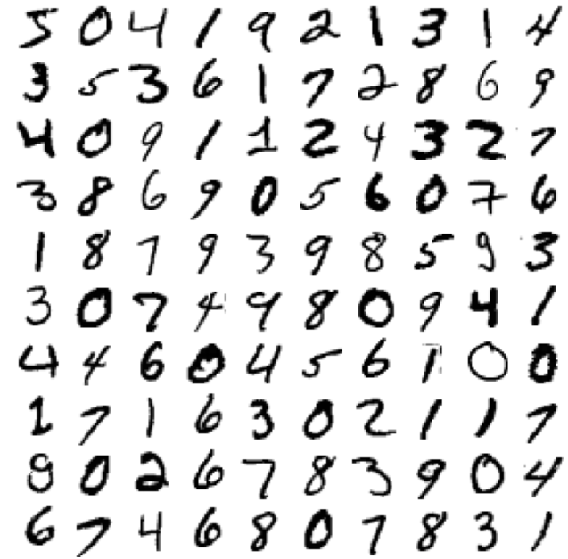

<h1>MNIST Dataset Classification using Machine Learning in Python</h1>
 
<h2>Features</h2>
<li>GIT LFS for Large DatSet MNIST.npy (800 mb)</li>

<h2>Acknowledgments</h2>

<b> Python3: http://bit.ly/python3-certifications <b>
 
<b> Machine Learning: https://bit.ly/machine-learning-certification <b>

<h2>Dataset CSV</h2>
<b> Link: https://bit.ly/mnist-datasetML<b>
 

<h2>Photo</h2>

 

<h2>Contact</h2>

<b> Email: mariusc0023@gmail.com </b>
